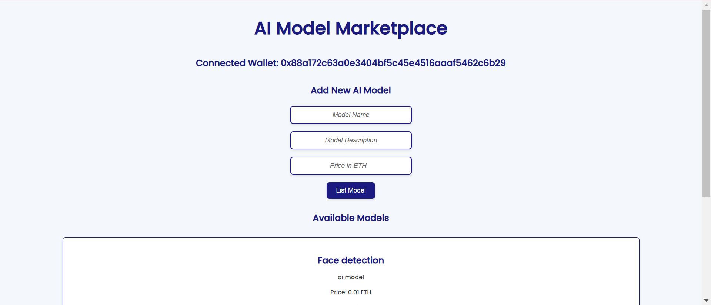

# AI Model Marketplace

Welcome to the AI Model Marketplace! This decentralized application (dApp) allows users to list, purchase, and rate AI models using Ethereum smart contracts. The marketplace is designed to provide a user-friendly interface for both model creators and buyers.

## Table of Contents

- [Features](#features)
- [Technologies Used](#technologies-used)
- [Installation](#installation)
- [Usage](#usage)
- [Smart Contract](#smart-contract)
- [Contributing](#contributing)
- [License](#license)

## Features

- **List AI Models**: Creators can list their AI models with descriptions and prices.
- **Purchase Models**: Users can purchase AI models directly through the marketplace.
- **Rate Models**: Users can rate the models they've purchased, contributing to the overall rating.
- **Withdraw Funds**: Creators can withdraw their earnings from sold models.

## Technologies Used

- **Ethereum**: The blockchain platform for deploying smart contracts.
- **Solidity**: The programming language for writing the smart contracts.
- **Web3.js**: A JavaScript library for interacting with the Ethereum blockchain.
- **HTML/CSS**: For the front-end user interface.
- **MetaMask**: A browser extension for managing Ethereum accounts.

  ## Screenshots
  
  

## Installation

1. **Clone the Repository**:
   ```bash
   git clone <repository-url>
   cd ai-model-marketplace
